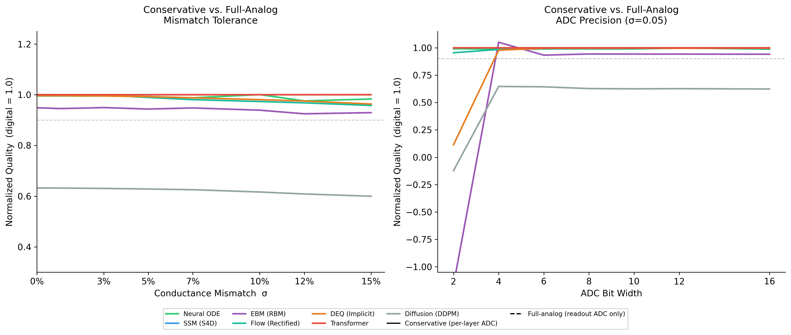

# neuro-analog

Analog hardware — crossbar arrays, RC integrators, differential-pair activations — can run neural network inference at orders-of-magnitude lower energy than digital, but it introduces unavoidable physical nonidealities: fabrication mismatch bakes static weight errors into every device, thermal noise corrupts every readout, and ADC quantization discretizes every layer boundary. Which neural architectures actually survive these conditions, and at what noise level does each one break?

This framework answers that empirically. It instruments any PyTorch model with physics-grounded analog nonidealities, measures how task-level quality degrades as noise increases, and extracts the model into a typed IR classifying each operation as analog-native, digital-required, or hybrid — then exports compatible models to [Ark](https://arxiv.org/abs/2309.08774) (Wang & Achour, ASPLOS '24) as runnable `BaseAnalogCkt` subclasses. The noise physics follows the mismatch/SDE/discrete-optimization model described in Wang & Achour (arXiv:2411.03557).

---

## Install

```bash
git clone https://github.com/apumutyala/neuro-analog
cd neuro-analog
pip install -e ".[dev]"
```

Optional extras: `[ssm]` for Mamba extraction, `[jax]` for Diffrax evaluation, `[full]` for everything.

---

## Quick start

```python
from neuro_analog.simulator import analogize, mismatch_sweep

analog_model = analogize(model, sigma_mismatch=0.05, n_adc_bits=8)
result = mismatch_sweep(model, eval_fn, sigma_values=[0.0, 0.05, 0.10, 0.15], n_trials=50)
print(result.degradation_threshold(max_relative_loss=0.10))  # σ at 90% quality
```

`analogize()` replaces `nn.Linear`, `nn.Conv*`, `nn.MultiheadAttention`, and analog-implementable activations with physics-grounded equivalents. Everything without an efficient analog circuit (LayerNorm, Softmax, dynamic Q·Kᵀ) stays digital.

See [`examples/01_quickstart.py`](examples/01_quickstart.py) for a full walkthrough.

---

## Experiment: Analog Tolerance across Neural Architecture Families

Seven neural network families trained on small-scale tasks, then swept over conductance mismatch σ ∈ {0–15%} with 50 Monte Carlo trials per point. Three noise sources ablated independently. ADC bit-width swept separately. Two simulation profiles: conservative (ADC at every layer boundary) and full-analog (ADC at final readout only).

The goal is to establish empirical baselines for which architectures are worth compiling to analog hardware and where the failure points are before committing to a chip design or running analog-aware adjoint optimization within Ark.

**Disclaimer:** These are simulation results on demo-scale models (1K–103K parameters) trained near capacity on synthetic and small benchmark tasks. They represent a worst-case bound for each architecture family — production-scale overparameterized models will degrade more gracefully. This is not hardware validation. Several physical effects are not simulated (see Nonidealities section). Results should be interpreted as characterizing the analog sensitivity of the architecture's computational structure, not a specific chip.

### Results (50 trials, conservative profile)

| Architecture | σ threshold @ 10% loss | Dominant noise | Min ADC bits |
|---|---|---|---|
| EBM | ≥ 15% | mismatch | 2 |
| SSM | ≥ 15% | mismatch | 4 |
| Transformer | ≥ 15% | mismatch | 4 |
| Neural ODE | ≥ 15% | mismatch | 2 |
| Diffusion | ≥ 15%† | quantization | N/A† |
| DEQ | 12% | mismatch | **6** |
| Flow | 10% | mismatch | 2 |

†Diffusion is mismatch-immune but quantization-limited under the conservative profile (per-layer ADC × 100 DDPM steps creates a constant ~15% quality floor regardless of bit-width). Resolves completely under the full-analog profile.

**Key finding (conservative):** Mismatch is the dominant noise source across 6/7 architectures. Flow and DEQ are the most sensitive, breaking down at σ=10% and σ=12% respectively. Five architectures remain robust to ≥15% mismatch within the 10% quality loss bound.

### Figures (conservative profile)

<table>
<tr>
<td><br><sub>Fig 1 — Mismatch tolerance curves</sub></td>
<td><br><sub>Fig 2 — Noise source attribution</sub></td>
</tr>
<tr>
<td><br><sub>Fig 3 — ADC bit-width sweep</sub></td>
<td><br><sub>Fig 4 — DEQ convergence failure rate</sub></td>
</tr>
<tr>
<td><br><sub>Fig 5 — Generated sample quality vs σ</sub></td>
<td><br><sub>Fig 6 — Output MSE vs σ</sub></td>
</tr>
</table>

---

### Results (50 trials, full-analog profile)

Full-analog defers ADC to the final readout only, removing per-layer quantization boundaries. For architectures compiled to crossbar arrays where a single output digitization step is feasible, this is the more realistic operating point.

| Architecture | σ threshold @ 10% loss | Dominant noise | Min ADC bits |
|---|---|---|---|
| SSM | ≥ 15% | mismatch | 2 |
| Transformer | ≥ 15% | mismatch | 2 |
| Neural ODE | ≥ 15% | mismatch | 2 |
| Flow | ≥ 15% | mismatch | 2 |
| Diffusion | ≥ 15% | mismatch | 2 |
| DEQ | 15% | mismatch | **4** |
| EBM | 10% | mismatch | **4** |

**Key finding (full-analog):** The simulation profile can reverse the architecture ranking, not just shift numbers. Five architectures are unaffected by the switch. EBM drops from ≥15% to a 10% threshold — per-step ADC binarization was inadvertently reinforcing the binary nature of Gibbs sampling; removing it exposes accumulated mismatch across 100 Gibbs steps. DEQ improves from 12% to a 15% threshold and drops its minimum ADC requirement from 6 to 4 bits — per-iteration ADC was creating fixed-point limit cycles that disappear when quantization is deferred to readout. Diffusion resolves completely: the constant ~15% quality floor from per-layer ADC × 100 DDPM steps disappears and 2-bit readout ADC is sufficient. Thermal noise remains negligible across all 7 at C=1pF / demo-scale layer widths.

### Figures (full-analog profile)

<table>
<tr>
<td><br><sub>Fig 7 — Conservative vs. full-analog profile comparison across all 7 architectures</sub></td>
</tr>
</table>

---

## Nonidealities modeled

| Nonideality | Coverage | What's simulated |
|---|---|---|
| **Process variation** (mismatch) | Full | δ~N(1,σ²) per weight, static across inferences — dominant failure mode in 6/7 architectures |
| **Quantization error** | Full | Hard ADC quantization; swept over {2,4,6,8,10,12,16} bits; conservative and full-analog profiles |
| **Thermal noise** | Full | Johnson-Nyquist ε~N(0, kT/C·N_in) per readout, dynamic per inference. Negligible at C=1pF / demo-scale widths |
| **Operating range** | Partial | Output saturation at ±V_ref (1V); activation swing clipping (AnalogTanh ±0.95, AnalogSigmoid [0.025, 0.975]). IR drop along crossbar rows not modeled |
| **Frequency / bandwidth** | Not modeled | No settling time, RC bandwidth limits, 1/f noise, or clock-rate vs. precision tradeoff |

Out of scope: PCM/RRAM conductance drift over time, multi-layer nonideality coupling. See [TECHNICAL_NOTE.md](experiments/cross_arch_tolerance/TECHNICAL_NOTE.md) §4.1.

---

## Run the experiments

```bash
cd experiments/cross_arch_tolerance
python train_all.py          # train all 7 models (~20 min CPU)
python sweep_all.py          # run all sweeps (~90 min CPU, 50 trials)
python plot_results.py       # generate figures
```

Single architecture, faster:

```bash
python sweep_all.py --only neural_ode --n-trials 20
python sweep_all.py --only diffusion --analog-substrate cld
```

---

## Ark integration

neuro-analog connects to [Ark](https://github.com/WangYuNeng/Ark) (Wang & Achour, ASPLOS '24) via two export paths:

**Path 1 — Direct code generation** (`neuro_analog/ir/ark_export.py`): Reads weights from the extracted `ODESystem` or `AnalogGraph` and emits a Python/JAX file containing a `BaseAnalogCkt` subclass with `make_args`, `ode_fn`, `noise_fn`, and `readout` implemented. The generated file is immediately runnable by Ark's `OptCompiler` and trains with the adjoint method via JAX/Diffrax.

```bash
python examples/04_ark_export.py              # Neural ODE (default)
python examples/04_ark_export.py --arch ssm   # SSM
python examples/04_ark_export.py --arch deq   # DEQ
```

**Path 2 — CDG bridge** (`neuro_analog/ark_bridge/neural_ode_cdg.py`): Converts Neural ODE weights in Hopfield/Cohen-Grossberg normal form (dx/dt = −x + J·tanh(x) + b + K·u) to a proper Ark `CDGSpec` → `CDG` → `OptCompiler` → `BaseAnalogCkt` subclass. This uses Ark's full compiler pipeline with typed node/edge production rules, per-weight `TrainableMgr` registration, and optional mismatch tagging.

```bash
python examples/05_cdg_bridge.py --n 4 --sigma 0.10
```

**Which architectures export to Ark:**

| Architecture | Export tier | Generated class | Notes |
|---|---|---|---|
| Neural ODE | Runnable `BaseAnalogCkt` | `NeuralODEAnalogCkt` | Two paths: direct + CDG bridge |
| SSM / Mamba | Runnable `BaseAnalogCkt` | `SSMAnalogCkt` | Direct path only; diagonal A → RC bank |
| DEQ | Runnable `BaseAnalogCkt` | `DEQAnalogCkt` | Fixed-point → ODE form (dz/dt = f−z) |
| Flow | Analysis document | `FlowODE` (plain class) | v_θ is 12B params, not a fixed ODE |
| Diffusion | Analysis document | `DiffusionDynamics` (plain class) | 100-step SDE schedule |
| Transformer | Not exported | — | No native ODE; Softmax is digital |
| EBM | Not exported | — | Gibbs sampling → p-bit, no ODE form |

Requires Ark, JAX, Diffrax, Equinox, Lineax (`pip install -e ".[jax]"`).

---

## Docs

- [`docs/simulator.md`](docs/simulator.md) — AnalogLinear, activations, ODE solver, sweep API, design decisions
- [`docs/experiments.md`](docs/experiments.md) — the 7 models, full results, complete vs. in-progress
- [`docs/ark_export.md`](docs/ark_export.md) — Ark export pipeline, two paths, per-architecture status

Full methodology and errata: [`experiments/cross_arch_tolerance/TECHNICAL_NOTE.md`](experiments/cross_arch_tolerance/TECHNICAL_NOTE.md)
