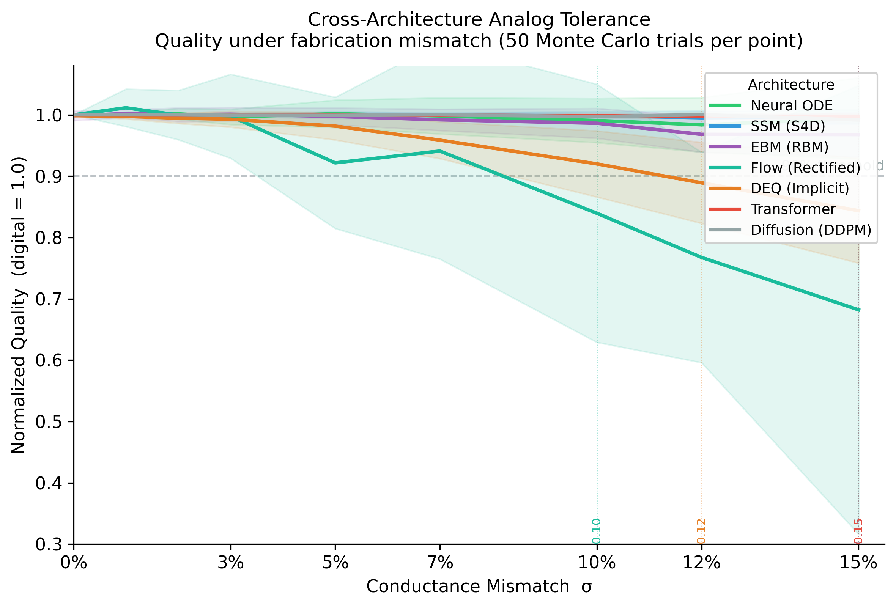
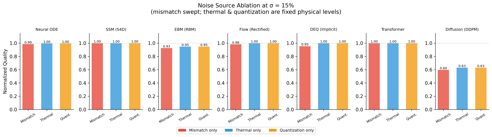
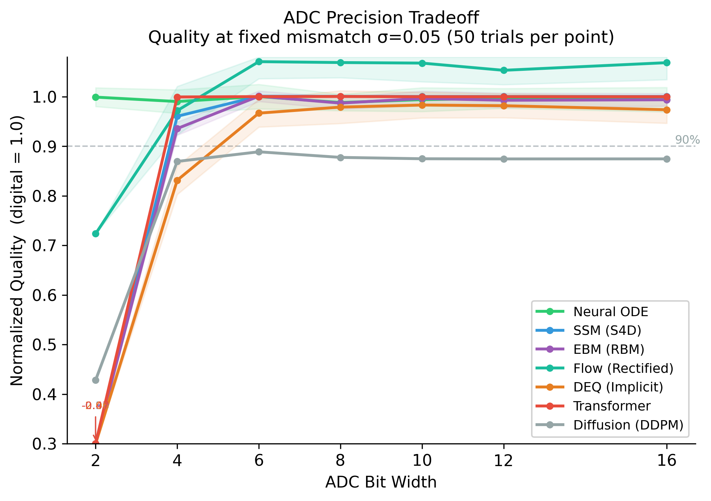
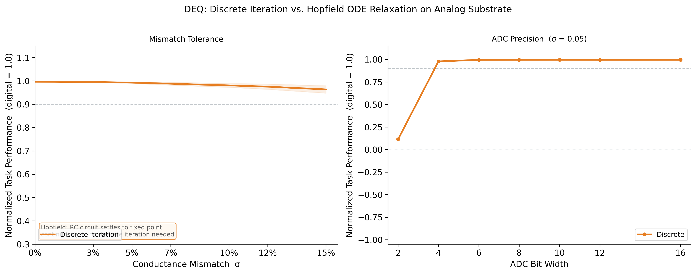
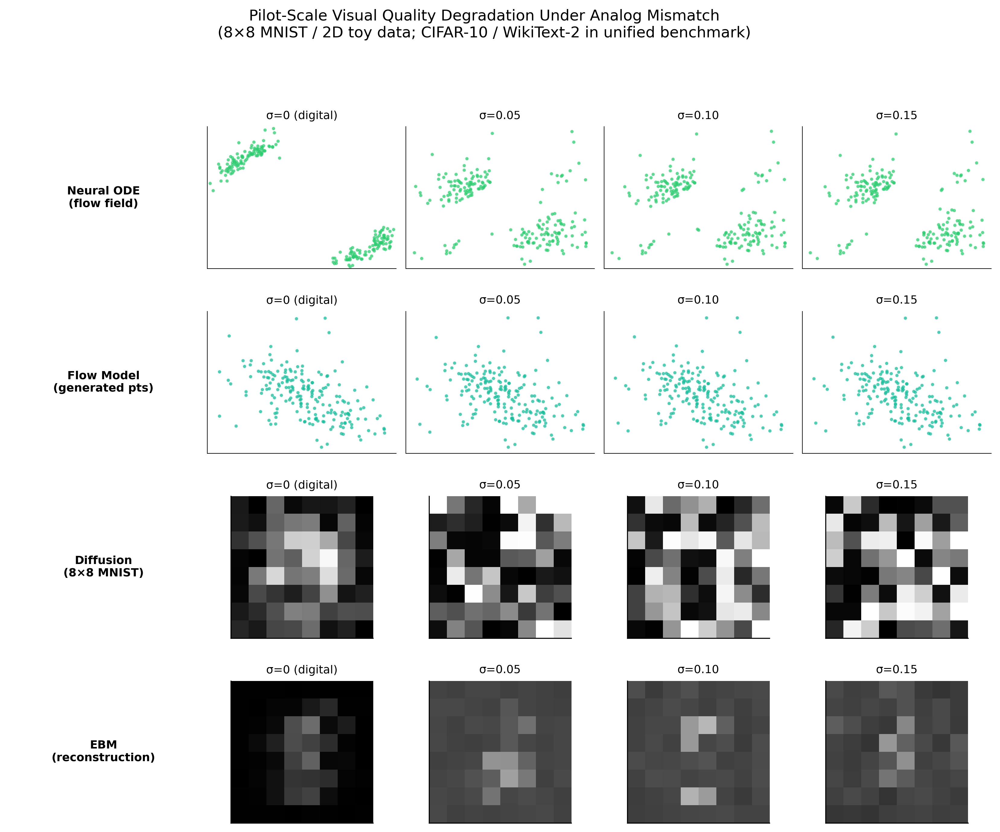
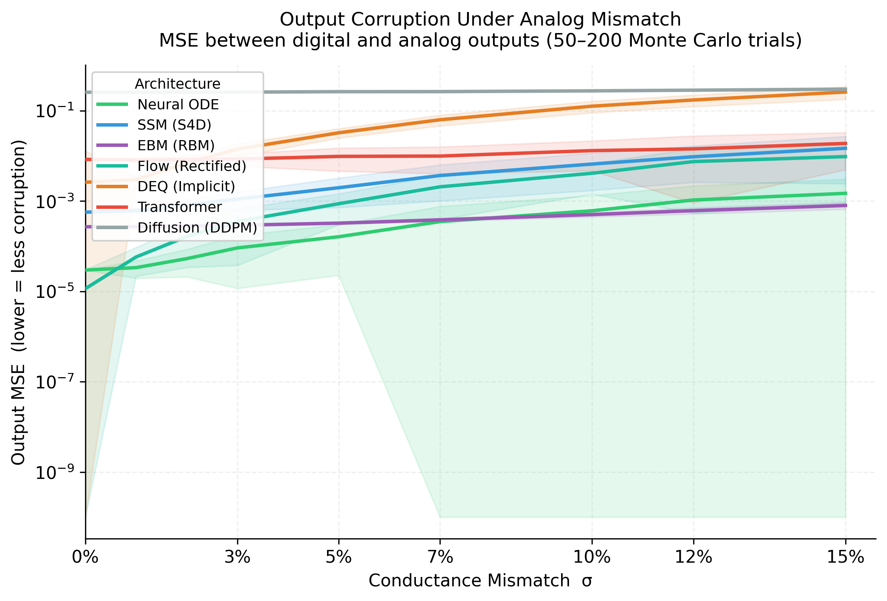

# neuro-analog

Analog hardware — crossbar arrays, RC integrators, differential-pair activations — can run neural network inference at orders-of-magnitude lower energy than digital, but it introduces unavoidable physical nonidealities: fabrication mismatch bakes static weight errors into every device, thermal noise corrupts every readout, and ADC quantization discretizes every layer boundary. Which neural architectures actually survive these conditions, and at what noise level does each one break?

This framework answers that empirically. It instruments any PyTorch model with physics-grounded analog nonidealities, measures how task-level quality degrades as noise increases, and extracts the model into a typed IR classifying each operation as analog-native, digital-required, or hybrid — feeding directly into the [Shem](https://arxiv.org/abs/2411.03557) (Achour & Wang, 2024) / [Ark](https://arxiv.org/abs/2309.08774) compilation pipeline.

---

## Install

```bash
git clone https://github.com/apumutyala/neuro-analog
cd neuro-analog
pip install -e ".[dev]"
```

Optional extras: `[ssm]` for Mamba extraction, `[jax]` for Diffrax evaluation, `[full]` for everything.

---

## Quick start

```python
from neuro_analog.simulator import analogize, mismatch_sweep

analog_model = analogize(model, sigma_mismatch=0.05, n_adc_bits=8)
result = mismatch_sweep(model, eval_fn, sigma_values=[0.0, 0.05, 0.10, 0.15], n_trials=50)
print(result.degradation_threshold(max_relative_loss=0.10))  # σ at 90% quality
```

`analogize()` replaces `nn.Linear`, `nn.Conv*`, `nn.MultiheadAttention`, and analog-implementable activations with physics-grounded equivalents. Everything without an efficient analog circuit (LayerNorm, Softmax, dynamic Q·Kᵀ) stays digital.

See [`examples/01_quickstart.py`](examples/01_quickstart.py) for a full walkthrough.

---

## Experiment: cross-architecture analog tolerance

Seven neural network families trained on small-scale tasks, then swept over conductance mismatch σ ∈ {0–15%} with 50 Monte Carlo trials per point. Three noise sources ablated independently. ADC bit-width swept separately. Two simulation profiles: conservative (ADC at every layer boundary) and full-analog (ADC at final readout only).

The goal is to establish empirical baselines for which architectures are worth compiling to analog hardware and where the failure points are — before committing to a chip design or running Shem optimization.

**Disclaimer:** These are simulation results on demo-scale models (1K–103K parameters) trained near capacity on synthetic and small benchmark tasks. They represent a worst-case bound for each architecture family — production-scale overparameterized models will degrade more gracefully. This is not hardware validation. Several physical effects are not simulated (see Nonidealities section). Results should be interpreted as characterizing the analog sensitivity of the architecture's computational structure, not a specific chip.

### Results (50 trials, conservative profile)

| Architecture | σ threshold @ 10% loss | Dominant noise | Min ADC bits |
|---|---|---|---|
| EBM | ≥ 15% | mismatch | 2 |
| SSM | ≥ 15% | mismatch | 4 |
| Transformer | ≥ 15% | mismatch | 4 |
| Neural ODE | ≥ 15% | mismatch | 2 |
| Diffusion | ≥ 15%† | quantization | N/A† |
| DEQ | 12% | mismatch | **6** |
| Flow | 10% | mismatch | 2 |

†Diffusion is mismatch-immune but quantization-limited under the conservative profile (per-layer ADC × 100 DDPM steps creates a constant ~15% quality floor regardless of bit-width). Resolves completely under the full-analog profile.

**Key finding:** The simulation profile (conservative vs. full-analog) can reverse the architecture ranking, not just shift numbers. EBM degrades in full-analog — per-step ADC binarization was inadvertently helping by reinforcing the binary nature of Gibbs sampling. DEQ improves in full-analog — per-iteration ADC was causing fixed-point limit cycles. Thermal noise is negligible across all 7 at C=1pF / demo-scale layer widths.

---

## Figures

<table>
<tr>
<td><br><sub>Fig 1 — Mismatch tolerance curves</sub></td>
<td><br><sub>Fig 2 — Noise source attribution</sub></td>
</tr>
<tr>
<td><br><sub>Fig 3 — ADC bit-width sweep</sub></td>
<td><br><sub>Fig 4 — DEQ convergence failure rate</sub></td>
</tr>
<tr>
<td><br><sub>Fig 5 — Generated sample quality vs σ</sub></td>
<td><br><sub>Fig 6 — Output MSE vs σ</sub></td>
</tr>
</table>

---

## Nonidealities modeled

| Nonideality | Coverage | What's simulated |
|---|---|---|
| **Process variation** (mismatch) | Full | δ~N(1,σ²) per weight, static across inferences — dominant failure mode in 6/7 architectures |
| **Quantization error** | Full | Hard ADC quantization; swept over {2,4,6,8,10,12,16} bits; conservative and full-analog profiles |
| **Thermal noise** | Full | Johnson-Nyquist ε~N(0, kT/C·N_in) per readout, dynamic per inference. Negligible at C=1pF / demo-scale widths |
| **Operating range** | Partial | Output saturation at ±V_ref (1V); activation swing clipping (AnalogTanh ±0.95, AnalogSigmoid [0.025, 0.975]). IR drop along crossbar rows not modeled |
| **Frequency / bandwidth** | Not modeled | No settling time, RC bandwidth limits, 1/f noise, or clock-rate vs. precision tradeoff |

Out of scope: PCM/RRAM conductance drift over time, multi-layer nonideality coupling. See [TECHNICAL_NOTE.md](experiments/cross_arch_tolerance/TECHNICAL_NOTE.md) §4.1.

---

## Run the experiments

```bash
cd experiments/cross_arch_tolerance
python train_all.py          # train all 7 models (~20 min CPU)
python sweep_all.py          # run all sweeps (~90 min CPU, 50 trials)
python plot_results.py       # generate figures
```

Single architecture, faster:

```bash
python sweep_all.py --only neural_ode --n-trials 20
python sweep_all.py --only diffusion --analog-substrate cld
```

---

## Docs

- [`docs/simulator.md`](docs/simulator.md) — AnalogLinear, activations, ODE solver, sweep API, design decisions
- [`docs/experiments.md`](docs/experiments.md) — the 7 models, full results, complete vs. in-progress
- [`docs/shem_export.md`](docs/shem_export.md) — Shem/Ark connection, export pipeline, next steps per architecture

Full methodology and errata: [`experiments/cross_arch_tolerance/TECHNICAL_NOTE.md`](experiments/cross_arch_tolerance/TECHNICAL_NOTE.md)
